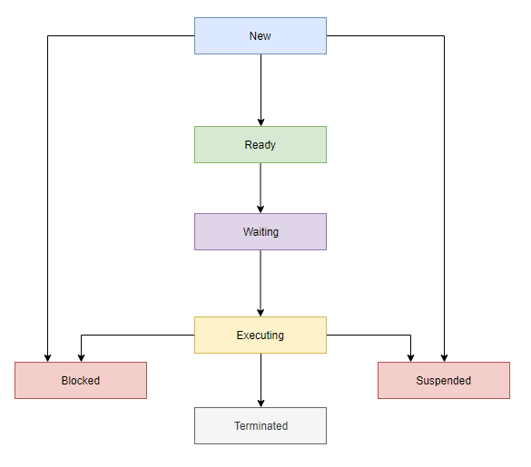

# **Process**

- The OS helps you to create, schedule, and terminates the processes which is used by CPU. A process created by the main process is called a child process.
- Process operations can be easily controlled with the help of `PCB(Process Control Block)`.
- **Stack**: The Stack stores temporary data like function parameters, returns addresses, and local variables.
- **Heap** Allocates memory, which may be processed during its run time.
- **Data**: It contains the variable.
- **Text**:
    Text Section includes the current activity, which is represented by the value of the Program Counter.

**There are mainly seven stages of a process which are:**

- **New**: The new process is created when a specific program calls from secondary memory/ hard disk to primary memory/ RAM a
- **Ready**: In a ready state, the process should be loaded into the primary memory, which is ready for execution.
- **Waiting**: The process is waiting for the allocation of CPU time and other resources for execution.
- **Executing**: The process is an execution state.
- **Blocked**: It is a time interval when a process is waiting for an event like I/O operations to complete.
- **Suspended**: Suspended state defines the time when a process is ready for execution but has not been placed in the ready queue by OS.
- **Terminated**: Terminated state specifies the time when a process is terminated

After completing every step, all the resources are used by a process, and memory becomes free.

**Process Control Block PCB**

")

- **Process state**: A process can be new, ready, running, waiting, etc.
- **Program counter or Instruction pointer(IP)**: The program counter lets you know the address of the next instruction, which should be executed for that process.
- **CPU registers**: This component includes accumulators, index and general-purpose registers, and information of condition code.
- **CPU scheduling information**: This component includes a process priority, pointers for scheduling queues, and various other scheduling parameters.
- **Accounting and business information**: It includes the amount of CPU and time utilities like real time used, job or process numbers, etc.
- **Memory-management information**: This information includes the value of the base and limit registers, the page, or segment tables. This depends on the memory system, which is used by the operating system.
- **I/O status information**: This block includes a list of open files, the list of I/O devices that are allocated to the process, etc.

**Thread**
- 

**Context Switch**
- The physical act of swapping threads on a core is called a context switch. A context switch happens when the scheduler pull an Executing thread off a core and replaces it with a runnable thread

**Url**
- Url: https://cloudflare.com/learning => `url = protocol + domain + path`

**Domain Name**
- google.com => `.com` is TLD, `google` is 2LD (most specific)

**DNS**
- Domain Name System

**New word**
| Word                |  Type  |    Pronunciation | Meaning                                                                                      |
| ------------------- | :----: | ---------------: | -------------------------------------------------------------------------------------------- |
| sequential          |  adj   |  `/sɪˈkwen.ʃəl/` | following a particular order                                                                 |
| delegate            |  noun  |    `ˈdel.ɪ.ɡət/` | a person chosen or elected by a group to speak, vote, etc. for them, especially at a meeting |
| broken up into      | phrase |                  | broken up into two or three parts                                                            |
| section             |  noun  |     `/ˈsek.ʃən/` | one of the parts that something is divided into                                              |
| hierarchy           |  noun  | `/ˈhaɪə.rɑː.ki/` | a system in which people or things are arranged according to their importance                |
| interrupt           |  verd  |  `/ˌɪn.təˈrʌpt/` | to stop a person from speaking for a short period by something you say or do                 |
| scheme              |  noun  |        `/skiːm/` | an organized plan for doing something, especially something dishonest or illegal             |
| crucial             |  adj   |    `/ˈkruː.ʃəl/` | extremely important or necessary                                                             |
| extremely           |  adv   | `/ɪkˈstriːm.li/` | very = extremely                                                                             |
| stand for something | phrase |                  | short write of something                                                                     |
